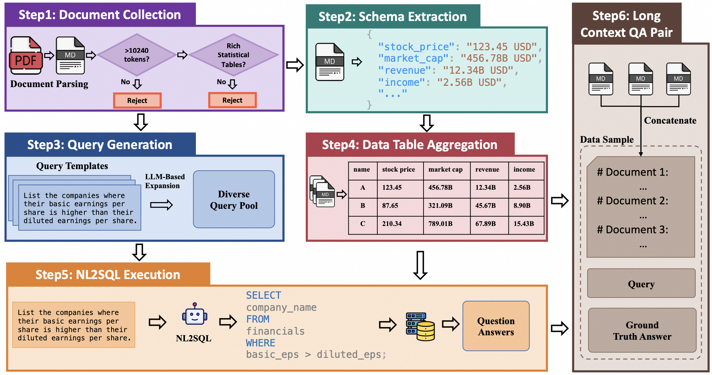

# CorpusQA: A 10 Million Token Benchmark for Corpus-Level Analysis and Reasoning

<p align="center">
  <a href"https://github.com/Tongyi-Zhiwen/CorpusQA/blob/main/requirements.txt"></a>
  <a href="LICENSE"></a>
  <a href="https://huggingface.co/datasets/Tongyi-Zhiwen/CorpusQA"></a>
</p>

<p align="center">
  📊 <a href="#-quick-start">Quick Start</a> • 🔧 <a href="#-detailed-usage">Usage Guide</a> • 📝 <a href="#-citation">Citation</a>
</p>

## 🚀 What's New
#### ```2025-12-04```
- We are releasing the first version of CorpusQA!
- 🚀 Benchmark: Contains 1,316 test instances across diverse domains like finance, education, and real estate, with context lengths ranging from 128K to 10M tokens.
- 📊 Evaluation Scripts: We provide the code for evaluating models and systems on CorpusQA.


## 📖 Overview
CorpusQA is a new benchmark designed to evaluate the corpus-level analysis and reasoning capabilities of LLMs, scaling up to 10 million tokens. It specifically targets tasks where evidence is highly dispersed across hundreds of documents, a scenario that invalidates standard "sparse retrieval" (RAG) approaches. The benchmark features:

* Massive Scale: Four context length settings from 128K up to 10M tokens.
* Complex Reasoning: Computation-intensive queries that require filtering, statistical aggregation, and cross-document computation.
* High Evidence Dispersion: Critical information is scattered across a large fraction of documents, demanding holistic understanding.
* Guaranteed Factual Grounding: Each question is paired with a programmatically generated ground-truth answer, ensuring 100% accuracy.
* Diverse & Multilingual Corpora: Spanning 3 domains (Finance, Education, Real Estate) in both English and Chinese.

## 🏗️ Benchmark Construction
CorpusQA is built through a novel schema-driven data synthesis framework that guarantees factual correctness and logical consistency without relying on a fallible LLM for annotation. The construction process involves six main stages, grouped into four key phases:

<div align="center">
  
</div>

📄 Document Curation and Structuring

The foundation of CorpusQA lies in high-quality, data-rich source documents.

* Document Collection & Filtering: We first collect real-world PDF documents and apply a two-stage filtering process. We retain only long documents (>10,240 tokens) that are rich with statistical tables and numerical data, ensuring they are suitable for complex analytical queries.
* Schema Extraction: To create a reliable structured representation, we use a robust multi-model voting approach. An ensemble of state-of-the-art LLMs extracts key-value pairs, and a consensus mechanism validates the data to filter out hallucinations and ensure high fidelity.

🤖 LLM-Augmented Query Generation

To create a diverse and challenging set of questions, we combine human expertise with LLM capabilities.

* Template-Based Query Design: We start by manually authoring high-quality query templates encapsulating various reasoning patterns (e.g., comparison, ranking, multi-step calculation).
* LLM-Powered Diversification: An LLM is then used to paraphrase and expand these templates, increasing linguistic diversity and preventing models from overfitting. The resulting queries are categorized by difficulty (Easy, Medium, Hard).

⚙️ Programmatic Ground Truth Generation

This phase is the cornerstone of our methodology, establishing an unimpeachable standard for evaluation.

* Data Table Aggregation: The structured JSON data extracted from every document in a corpus is aggregated into a single, global data table, which serves as the canonical knowledge base.
* NL2SQL Execution: Each natural language query is translated into an executable SQL statement. This SQL is then run against the aggregated data table to programmatically compute a 100% accurate ground-truth answer.

🧩 Final QA Pair Assembly

In the final stage, the benchmark instance is assembled by combining:

1. The Context: The original, full-text unstructured documents, concatenated together.
2. The Question: A natural language query from our generated pool.
3. The Answer: The programmatically derived ground-truth answer.

This final structure challenges a model to perform sophisticated, corpus-level reasoning over raw, unstructured text to derive an answer that we have systematically computed on a structured backend.

## 🚀 Quick Start

### Automated Setup (Recommended)

Run the setup script to automatically configure your environment:

```bash
# Clone the repository
git clone https://github.com/Tongyi-Zhiwen/CorpusQA.git
cd CorpusQA

# Run setup script
./scripts/setup.sh

# Edit .env and add your API key
nano .env  # or use your preferred editor

# Source environment variables
source .env

# Run example (replace with your dataset path)
./scripts/run_example.sh data/your_dataset.jsonl
```

### Manual Setup

If you prefer manual setup:

1. Install dependencies:
```bash
pip install -r requirements.txt
```

2. Set up your API key as an environment variable:
```bash
export DASHSCOPE_API_KEY="your-api-key-here"
```

3. Create necessary directories:
```bash
mkdir -p data runs evals
```

## 🔧 Detailed Usage

### Prerequisites

- Python 3.8 or higher
- DashScope API key (get it from [DashScope](https://dashscope.aliyuncs.com/))

### 1. Inference

Run inference on your benchmark dataset:

```bash
python src/infer.py \
  --prompt_file /path/to/your/dataset.jsonl \
  --model gemini-2.5-flash \
  --concurrency 32 \
  --output_dir runs
```

**Parameters:**
- `--prompt_file`: Path to the input JSONL file containing prompts (required)
- `--model`: Model name to use for inference (default: gemini-2.5-flash)
- `--concurrency`: Number of concurrent requests (default: 32)
- `--output_dir`: Directory to save results (default: runs)

**Input Format:**
Each line in the JSONL file should contain:
```json
{
  "id": "unique_question_id",
  "prompt": [{"role": "user", "content": "your prompt here"}],
  "question": "the question text",
  "answer": "ground truth answer"
}
```

**Output:**
Results will be saved to `{output_dir}/{model}_{input_filename}.jsonl`

### 2. Evaluation

Evaluate model responses against ground truth:

```bash
python src/eval.py \
  --input_file gemini-2.5-flash_financial_en_set1.jsonl \
  --model deepseek-v3
```

**Parameters:**
- `--input_file`: The JSONL filename in the runs directory (from step 1)
- `--model`: Model to use for evaluation (default: deepseek-v3)

> 💡 **Important Note on Empty Answers:** You will find that some ground-truth answers are an empty list "[]". This is normal and by design. It means that no entities (e.g., companies, schools) were found that meet the query's specific criteria. This scenario is common in real-world applications where a query may legitimately yield no matches.

### Resume Support

Both scripts support resume functionality:
- If interrupted, simply re-run the same command
- Already processed items will be skipped automatically
- Progress is preserved across runs

## 📂 Project Structure

```
CorpusQA/
├── src/                         # Source code
│   ├── infer.py                # Inference script for running LLM evaluation
│   └── eval.py                 # Evaluation script using LLM-as-judge
├── scripts/                     # Automation scripts
│   ├── setup.sh                # Environment setup script
│   └── run_example.sh          # Example execution script
├── data/                        # Benchmark datasets (download separately)
├── runs/                        # Inference outputs (auto-generated)
├── evals/                       # Evaluation results (auto-generated)
├── .env.example                 # Environment variable template
├── requirements.txt             # Python dependencies
└── README.md                    # This file
```

## 📝 Citation

If you find our work helpful, please cite our paper:

```bibtex
@article{lu2025corpusqa,
      title={CorpusQA: A 10 Million Token Benchmark for Corpus-Level Analysis and Reasoning}, 
      author={Zhiyuan Lu and Chenliang Li and Yingcheng Shi and Weizhou Shen and Ming Yan and Fei Huang},
      year={2025},
}
```

